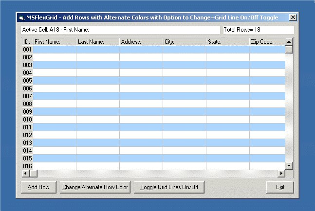



## MSFlexGrid Manipulation

### Description

Add Rows to a MSFlexGrid With Alternating Colors.

Option to Change Color Of Alternating Row.

Option to Toggle Grid Lines On and Off.

Please Vote For Me!! This is my First Posting on PlanetSourceCode.

*** MAJOR UPDATE Coming Very Soon ***
 
### More Info
 
I anybody who wants to manipulate the grid further

i.e Forecolor, Backcolor of Grid Lines, Cells etc.

Or what ever! Let me know I will try to help.

None Known

             |
---                |---
**Submitted On**   |2001-01-10 12:22:38
**By**             |[David J Norton](https://github.com/Planet-Source-Code/PSCIndex/blob/master/ByAuthor/david-j-norton.md)
**Level**          |Intermediate
**User Rating**    |4.5 (54 globes from 12 users)
**Compatibility**  |VB 5\.0, VB 6\.0
**Category**       |[Custom Controls/ Forms/  Menus](https://github.com/Planet-Source-Code/PSCIndex/blob/master/ByCategory/custom-controls-forms-menus__1-4.md)
**World**          |[Visual Basic](https://github.com/Planet-Source-Code/PSCIndex/blob/master/ByWorld/visual-basic.md)
**Archive File**   |[CODE\_UPLOAD136341102001\.zip](https://github.com/Planet-Source-Code/david-j-norton-msflexgrid-manipulation__1-14315/archive/master.zip)

